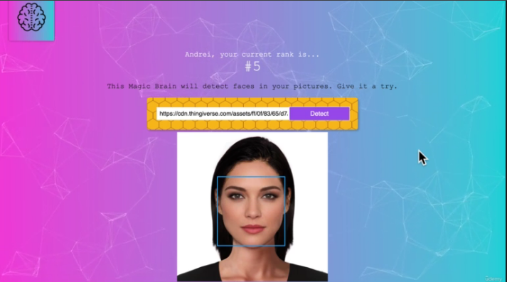

# Smartbrain - Face Recognition App

- Using machine learning API, this app can detect human faces from an image given by user.

# Frontend
- Built with .
- Styling done using npm package 

# Server  
- Built with .

# Database 
- Built with 

# Bugs that recently appeared
- These will be solved within few days.

1. Update Clarifai API call with .
2. Add  in background for styling
3. Deploy new version on  once more.
