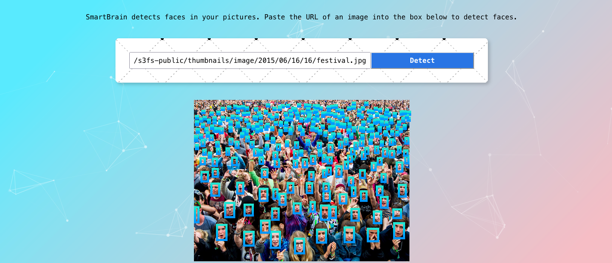

# Smartbrain - Face Recognition App

- Using machine learning API, this app can detect human faces from an image given by user.

# Frontend
- Built with .
- Styling done using npm package 

# Server  
- Built with .

# Database 
- Built with 

# Next maintainance
- It is scheduled on 26.08.2023

# New Features to come 
- User able to delete their own account.
- Guide of how this web app works.
